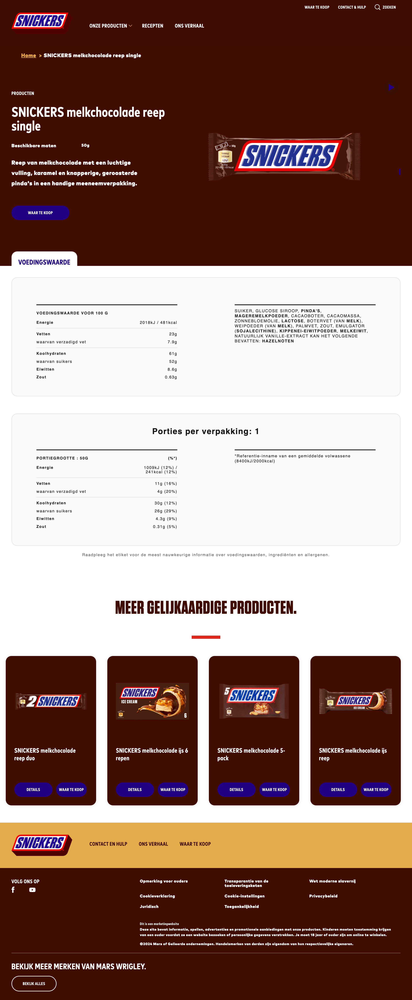
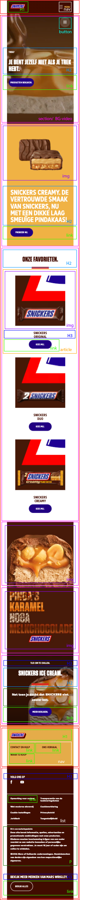

# Procesverslag
Markdown is een simpele manier om HTML te schrijven.  
Markdown cheat cheet: [Hulp bij het schrijven van Markdown](https://github.com/adam-p/markdown-here/wiki/Markdown-Cheatsheet).

Nb. De standaardstructuur en de spartaanse opmaak van de README.md zijn helemaal prima. Het gaat om de inhoud van je procesverslag. Besteedt de tijd voor pracht en praal aan je website.

Nb. Door *open* toe te voegen aan een *details* element kun je deze standaard open zetten. Fijn om dat steeds voor de relevante stuk(ken) te doen.

## Jij

  
uitwerken voor kick-off werkgroep

  ### Auteur:
  Splinter van Halewijn

  #### Je startniveau:
  blauw

  #### Je focus:
  responsive 
 

## Je website

  
uitwerken voor kick-off werkgroep

  ### Je opdracht:
  https://www.snickers.nl/

  #### Screenshot(s) van de eerste pagina (small screen): 
  home-page  
  

  #### Screenshot(s) van de tweede pagina (small screen):
  event-page  
  
 

## Toegankelijkheidstest 1/2 (week 1)

  
uitwerken na test in 2e werkgroep

  ### Bevindingen
  Lijst met je bevindingen die in de test naar voren kwamen:

  1. h1 en h2 iomgedraaid
  2. logo moet h1 worden
  3. geen alt bij afbeeldingen
  4. geen audio bij video
  5. autoplay staat standaard aan.
  6. button kleur valt weg bij bruine achtergrond

## Breakdownschets (week 1)

  
uitwerken na afloop 3e werkgroep

  ### de hele pagina: 
  

## Voortgang 1 (week 2)

  
uitwerken voor 1e voortgang

  ### Stand van zaken
  hier dit ging goed & dit was lastig (neem ook screenshots op van delen van je website en code)

  basis structuur gaat nog redelijk, moeite met overzicht houden en structuur volgorde.

  ### Agenda voor meeting
  samen met je groepje opstellen

  | student 1      | student 2          | student 3    | student 4        |
  | ---            | ---                | ---          | ---              |
  | dit bespreken  | en dit             | en ik dit    | en dan ik dat    |
  | en dat ook nog | dit als er tijd is | nog een punt | dit wil ik zeker |
  | ...            | ...                | ...          | ...              |

vragen:

1. opbouw code, hoe werk ik het beste door waarbij ik een goede structuur opbouw?

2. verschillende buttons stylen met zo min mogelijk code?

3. hamburger menu uitklappen?

4. play button aan video koppelen?

  ### Verslag van meeting
  hier na afloop snel de uitkomsten van de meeting vastleggen

  site begint een begin te krijgen, nog lastig om te weten wanneer ik moet beginnen en ken veel elementen niet meer....

## Voortgang 2 (week 3)

  
uitwerken voor 2e voortgang

  ### Stand van zaken
basi van de html staat zo goed als, moet nog wel veel gesrtyled worden.

  ### Agenda voor meeting
  samen met je groepje opstellen

  | student 1      | student 2          | student 3    | student 4        |
  | ---            | ---                | ---          | ---              |
  | dit bespreken  | en dit             | en ik dit    | en dan ik dat    |
  | en dat ook nog | dit als er tijd is | nog een punt | dit wil ik zeker |
  | ...            | ...                | ...          | ...              |

  ### Verslag van meeting
  hier na afloop snel de uitkomsten van de meeting vastleggen

gaat een stuk beter, de site begint wat meer vorm te krijgen, maak mij wel erg druk om het later scalable maken voor andere formaten.
- ...

## Toegankelijkheidstest 2/2 (week 4)

  
uitwerken na test in 9e werkgroep

  ### Bevindingen
  Lijst met je bevindingen die in de test naar voren kwamen (geef ook aan wat er verbeterd is):

  Uit de tweedde test is gebleken dat er nu wel met de screenreader door de pagina heen gegaan kan worden. kleur verschillen zijn beter. afbeeldingen hebben namen. h1 en h2 vaak omgedraaid, nu verholpen. 

## Voortgang 3 (week 4)

  
uitwerken voor 3e voortgang

  ### Stand van zaken
  hier dit ging goed & dit was lastig (neem ook screenshots op van delen van je website en code)

  ### Agenda voor meeting
  samen met je groepje opstellen

  | student 1      | student 2          | student 3    | student 4        |
  | ---            | ---                | ---          | ---              |
  | dit bespreken  | en dit             | en ik dit    | en dan ik dat    |
  | en dat ook nog | dit als er tijd is | nog een punt | dit wil ik zeker |
  | ...            | ...                | ...          | ...              |

  ### Verslag van meeting
  hier na afloop snel de uitkomsten van de meeting vastleggen

  het gaat stukken beter, we hebben gekeken naar grid en hoe ik dat beter kon toepassen wat ik nu nog helemaal niet deed en daardoor erg in de knoei kwam. verder moet er aan de structuur gewerkt worden szodat het overzichtelijk blijft en bewerkbaar.

## Eindgesprek (week 5)

  
uitwerken voor eindgesprek

  ### Je uitkomst - karakteristiek screenshots:
  

  ### Dit ging goed/Heb ik geleerd: 
  Korte omschrijving met plaatjes

  ik hgeb geleerd te stylen met grid, css positioneren.

  

  ### Dit was lastig/Is niet gelukt:
  Korte omschrijving met plaatjes

  

## Bronnenlijst

  
continu bijhouden terwijl je werkt

  Nb. Wees specifiek ('css-tricks' als bron is bijv. niet specifiek genoeg). 
  Nb. ChatGpT en andere AI horen er ook bij.
  Nb. Vermeld de bronnen ook in je code.

  1. bron 1
  2. bron 2
  3. ...

